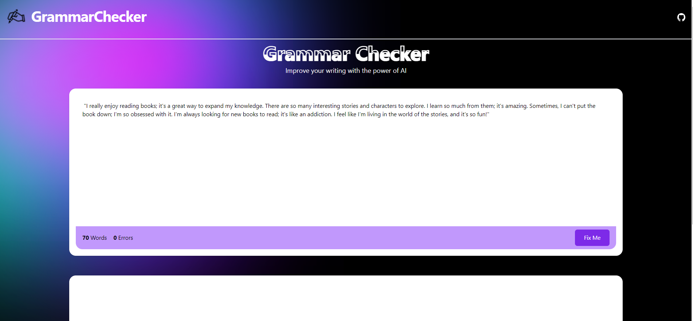
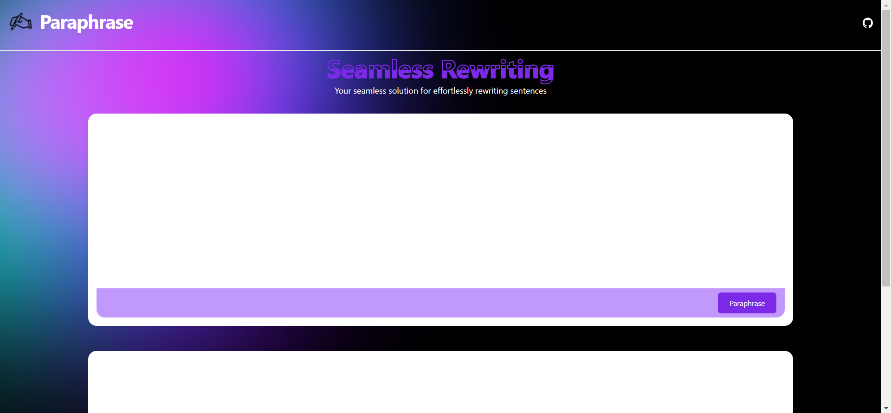
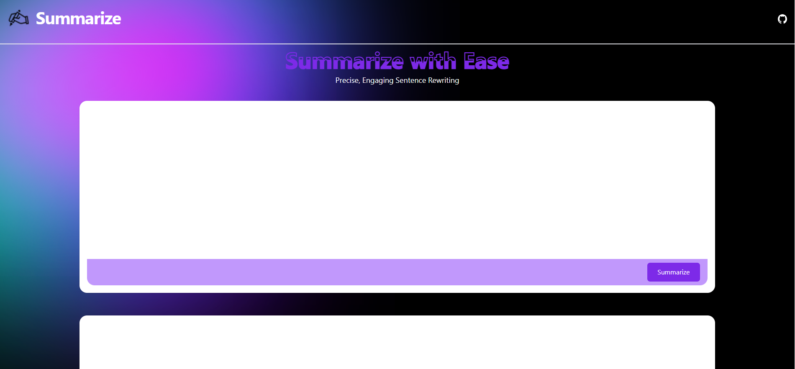
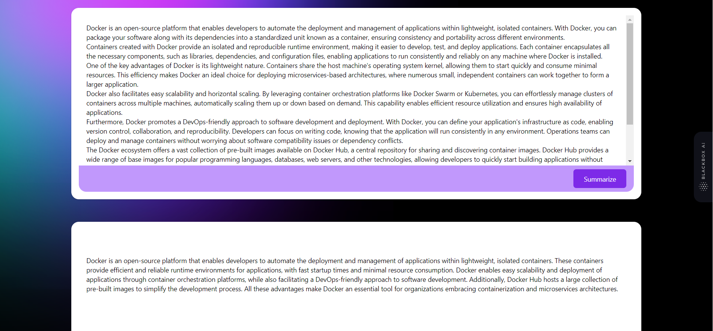

# Prosemaster

Prosemaster is an AI-driven platform that helps you perfect your grammar, rephrase sentences, summarize texts, and create captivating articles effortlessly. It enhances your writing and communication skills, making it an essential tool for content creators, students, professionals, and anyone seeking to improve their written communication.

## Features

- Grammar perfection: Prosemaster leverages advanced AI algorithms to identify and correct grammar mistakes in your text, ensuring that your writing is error-free and professional.
- Sentence rephrasing: The platform suggests alternative phrasings for your sentences, helping you improve clarity, conciseness, and overall readability.
- Text summarization: Prosemaster summarizes lengthy texts, saving you time and effort by providing concise and coherent summaries that capture the main ideas.
- Captivating article generation: Generate engaging articles using Prosemaster's AI-powered writing assistance. It helps you craft compelling content by offering creative suggestions, enhancing your writing style, and ensuring coherence.

 

## Technologies Used

- Next.js: A powerful React framework for building server-side rendered and statically generated web applications.
- OpenAI: Cutting-edge artificial intelligence models for natural language processing tasks, empowering Prosemaster's grammar correction, sentence rephrasing, and text summarization features.
- Tailwind CSS: A utility-first CSS framework that provides a flexible and efficient way to style your website. It offers a wide range of pre-built components and customizable design options.

## Getting Started

Follow these steps to set up the Prosemaster project locally:

1. Clone the repository: `git clone https://github.com/doniaskima/Prosemaster`
2. Install dependencies: `npm install`
3. add .env OPENAI_API_KEY= ur key :3
4. Start the development server: `npm run dev`
5. Access the website: Open your browser and visit `http://localhost:3000`

## Contributing

Contributions to Prosemaster are welcome! If you'd like to contribute, please follow these guidelines:

- Fork the repository and create a new branch.
- Make your changes and ensure that the project builds successfully.
- Write appropriate tests for your changes if applicable.
- Open a pull request, describing the changes you've made.

## Contact

If you have any questions, suggestions, or feedback, please feel free to reach out to our team at [doniaskima344@gmail.com]. We'd be happy to assist you!
